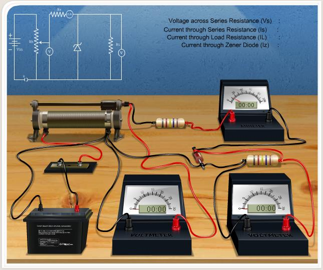
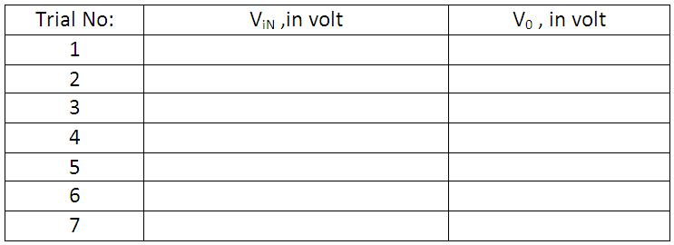
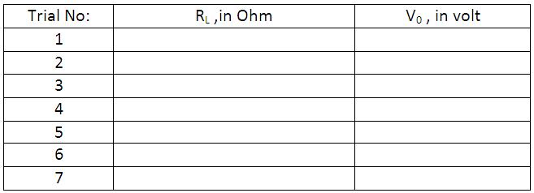

### Apparatus
 
Zener diode, resistor, variable DC power supply, milliammeter, voltmeter, Rheostat  and wire.

#### Controls

**Insert Key Button:**  This is used to insert key on the switch connected with the battery. This key is only activated when the connection is perfect.

**Choose Zener Diode:** This combo box is used to select different zener diodes having different zener voltages.

**Series Resistance:**  Value of the Series Resistance can be directly input here.

#### Slider

**Rheostat Value:**  Rheostat can be controlled by using this slider.

**Load Resistance:** Value of load resistance can be set or changed by using this slider.

#### Button

**Reset Button:**  To reset all the connections.

## Procedure
 
Using the circuit diagram, identify the connections in the given platform. Connections are made as shown in the below diagram.

### How to make connections in simulation ?
 
Click one end node of the battery and drag to the next position, where we want to connect the wire. Just like shown in the figures below:

### Full connection diagram 

If the connections are correct, **Insert Key** option activated.

## Line Regulation

1. Choose the zener diode to start the experiment.
2. Insert the series resistance value.
3. Fix the load resistance value by using the $Load **Resistance** slider.
4. Change the **Rheostat** value from maximum to 0 in intervals of 100.
5. Note down the corresponding input voltage and output voltage, and tabulate it.
6. Plot the graph with $Vin$ on the x-axis and $V_L$ on the y-axis.

Percentage of Line regulation = $\left[ \frac{\Delta V_0}{\Delta V_{in}}\right] \times 100$

## Load Regulation

1. First 3 steps are the same as above.
2. Fix the **Rheostat** value to get 12 V at the voltmeter across the rheostat.
3. Change the **Load Resistance** in intervals of 100 Ω / 1000 Ω up to the maximum range.
4. Note the readings and tabulate them.
5. Plot the graph with $V_0$ on the x-axis and $R_L$ on the y-axis.

Let us consider $V_{NL}$ is the output voltage when there is no load resistance (ideally VNL = Zener voltage) and $V_{FL}$ is the output voltage when load resistance is maximum. 

Percentage of Load regulation = $\left[ \frac{V_{NL}-V_{FL}}{V_{NL}}\right]\times 100$

**Note:** This is an ideal circuit. For a real circuit, there will be small variations in output voltage with varying input voltage or load resistance.
