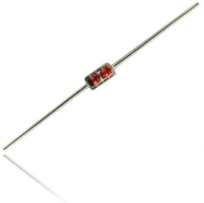
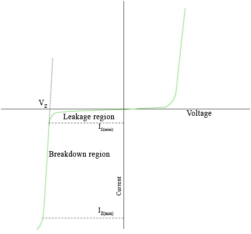
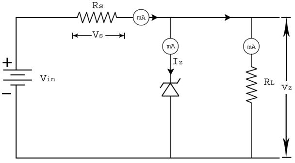

## Theory

### Zener Diode

The Zener diode is like a general-purpose signal diode. When biased in the forward direction it behaves just like a normal signal diode, but when a reverse voltage is applied to it, the voltage remains constant for a wide range of currents.

  
Figure 1: Zener diode
 

**Avalanche Breakdown**: There is a limit for the reverse voltage. Reverse voltage can increase until the diode breakdown voltage is reached. This point is called the **Avalanche Breakdown** region. At this stage, maximum current will flow through the Zener diode. This breakdown point is referred to as the **Zener voltage**.

The Zener diode is used in its **reverse bias**. From the I-V characteristics curve, we can observe that the Zener diode has a region in its reverse bias characteristics where the voltage remains almost constant — regardless of the value of the current flowing through the diode — and remains nearly constant even with large changes in current, as long as the Zener diode's current remains between the breakdown current $I_{Z(min)}$ and the maximum current rating $I_{Z(max)}$.

This ability to regulate itself can be used to great effect to regulate or stabilize a voltage source against supply or load variations. The fact that the voltage across the diode in the breakdown region is almost constant makes the Zener diode an important component in **voltage regulator** circuits.

### Characteristics
Figure 2 shows the current versus voltage curve for a Zener diode. Observe the nearly constant voltage in the breakdown region.

Figure 2: Zener diode characteristic curve

The forward bias region of a Zener diode is identical to that of a regular diode. The typical forward voltage at room temperature with a current of around 1 mA is around 0.6 volts. In the reverse bias condition the Zener diode is an open circuit and only a small leakage current is flowing as shown on the exaggerated plot. As the breakdown voltage is approached the current will begin to avalanche. The initial transition from leakage to breakdown is soft but then the current rapidly increases as shown on the plot. The voltage across the Zener diode in the breakdown region is very nearly constant with only a small increase in voltage with increasing current. At some high current level the power dissipation of the diode becomes excessive and the part is destroyed. There is a minimum Zener current, Iz(min), that places the operating point in the desired breakdown. There is a maximum Zener current, Iz(max), at which the power dissipation drives the junction temperature to the maximum allowed. Beyond that current the diode can be damaged.

Zener diodes are available from about 2.4 to 200 volts typically using the same sequence of values as used for the 5% resistor series – 2.4, 2.7, 3.0, 3.3, 3.6, 3.9, 4.3, 4.7, 5.1, 5.6, 6.2, 6.8, 7.5, 8.2, 9.1, 10, 11, 12, 13, 15, 16, 18, 20, 22, 24, etc. All Zener diodes have a power rating, Pz. From Watt’s law the maximum current is: IZ(MAX) = PZ / VZ Zener diodes are typically available with power ratings of 0.25, 0.4, 0.5, 1, 2, 3, and 5 watts although other values are available.

### Zener Diode as Voltage Regulators

The function of a regulator is to provide a constant output voltage to a load connected in parallel with it in spite of the ripples in the supply voltage or the variation in the load current and the zener diode will continue to regulate the voltage until the diodes current falls below the minimum IZ(min) value in the reverse breakdown region. It permits current to flow in the forward direction as normal, but will also allow it to flow in the reverse direction when the voltage is above a certain value - the breakdown voltage known as the Zener voltage. The Zener diode specially made to have a reverse voltage breakdown at a specific voltage. Its characteristics are otherwise very similar to common diodes. In breakdown the voltage across the Zener diode is close to constant over a wide range of currents thus making it useful as a shunt voltage regulator.

The purpose of a voltage regulator is to maintain a constant voltage across a load regardless of variations in the applied input voltage and variations in the load current. A typical Zener diode shunt regulator is shown in Figure 3. The resistor is selected so that when the input voltage is at VIN(min) and the load current is at IL(max) that the current through the Zener diode is at least IZ(min). Then for all other combinations of input voltage and load current the Zener diode conducts the excess current thus maintaining a constant voltage across the load. The Zener conducts the least current when the load current is the highest and it conducts the most current when the load current is the lowest.

Figure 3: Zener diode shunt regulator

If there is no load resistance, shunt regulators can be used to dissipate total power through the series resistance and the Zener diode. Shunt regulators have an inherent current limiting advantage under load fault conditions because the series resistor limits excess current.

A zener diode of break down voltage **Vz** is reverse connected to an input voltage source **Vi** across a load resistance **RL** and a series resistor **RS**. The voltage across the zener will remain steady at its break down voltage **VZ** for all the values of zener current **IZ** as long as the current remains in the break down region. Hence a regulated DC output voltage **V0 = VZ** is obtained across **RL**, whenever the input voltage remains within a minimum and maximum voltage.

Basically, there are two types of regulation such as:

#### a) Line Regulation
 

In this type of regulation, series resistance and load resistance are fixed, only input voltage is changing. Output voltage remains the same as long as the input voltage is maintained above a minimum value.

Percentage of line regulation can be calculated by = $\frac{\Delta V_0}{\Delta V_{IN}}\times 100$

where $V_0$ is the output voltage and $V_{IN}$ is the input voltage and  $\Delta V_0$ is the change in output voltage for a particular change in input voltage $\Delta V_{IN}$.

#### b) Load Regulation

In this type of regulation, input voltage is fixed and the load resistance is varying. Output volt remains same, as long as the load resistance is maintained above a minimum value.

Percentage of load regulation = $\left[ \frac{V_{NL}-V_{FL}}{V_{NL}} \right] \times 100$

Where $V_{NL}$  is the null load resistor voltage (ie. remove the load resistance and measure the voltage across the Zener Diode) and $V_{FL}$ is the full load resistor voltage.

#### Design a Voltage Regulator
   

When selecting the zener diode, be sure that its maximum power rating is not exceeded.

$I_{max}$ : Maximum current for Zener diode

$$I_{max}=\frac{\text{Power}}{\text{Zener voltage}}$$

$V_Z$          Zener Diode standard  voltage  
$V_{in}$          Input voltage(it is known)  
$V_S$           Voltage across series resistance 
$V_L$           Voltage across the load resistance 
$I_S$            Current passing through the series resistance 
$I_Z$            Current passing through the Zener diode 
$I_L$            Current passing through the load resistance 

### Calculating voltage and current 

The total current drawn from the source is the same as that through the series resistor 

$$I_S=\frac{V_S}{R_S}$$

The current through the load resistor is  

$$I_L=\frac{V_L}{R_L}$$

 and the zener diode current is 

 $$I_Z=I_S-I_L$$

 If the voltage source is greater than $V_Z$

 $$V_S=V_{in}-V_L \text{ and } V_L=V_Z$$

If the voltage source is less than $V_Z$

$$V_S=\frac{R_SV_{in}}{(R_S+R_L)} \text{ and } V_L=\frac{R_LV_{in}}{R_S+R_L}$$

